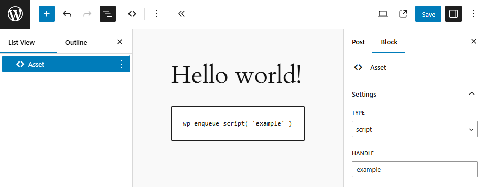

# WordPress Asset Block

This plugin adds an Asset Block for enqueueing registered scripts and styles in content, solving the issue of loading assets with patterns.

## Usage

### 1. Register script or style

```php
add_action( 'init', function() {
    wp_register_script( 'example', 'https://example.com/script.js' );
    wp_register_style( 'example', 'https://example.com/style.css' );
```

### 2. Add Asset Block in editor and select registered script or style



## Requirements

* PHP >= `7.4` version.
* WordPress >= `6.0` version.

## License

[GPL v3 or later](license.txt)